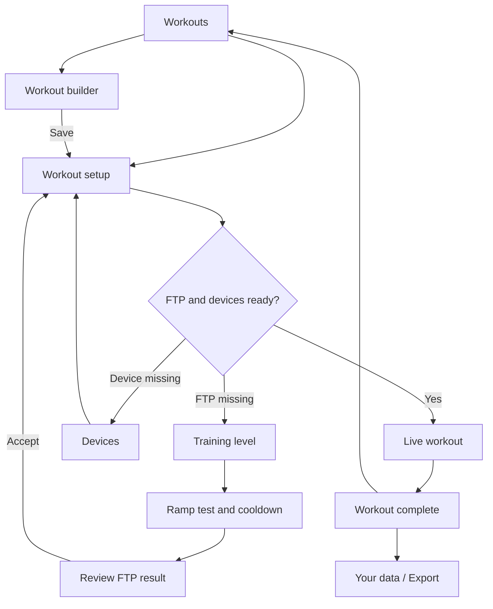

# Indoor cycling app: UX and flow specification

**Version:** 0.1 - 29 September 2026  
**Status:** Design draft captured from our discussion. This describes the intended product, not a claim that every feature is implemented.  
**Scope:** App flow, screens, interactions and data ownership. Naming and logo design are excluded.

The companion PDF contains the visual concepts. This Markdown file is the editable reference; it is self-contained and does not depend on image attachments.

## 1. Product intent

A focused indoor cycling app that connects to a compatible trainer, runs structured workouts and lets riders keep and export their data. The initial hardware context is a Wahoo KICKR CORE 2 with Zwift Ride controls, accessed through a Rust-to-WASM library.

The app opens on **Workouts**. Its purpose is choosing, building and completing workouts. There is no next-ride dashboard, training calendar, social feed or automatic recommendation system in this scope.

Power targets scale from the rider's accepted FTP. Workouts can run in ERG or Shift mode. Power, cadence and heart rate are visible when their sources provide them. The visual road represents the workout plan over time.

## 2. Navigation and main flow

| Section | Purpose | Main actions |
|---|---|---|
| Workouts | Choose and build a workout | Browse, filter, view, create, import, start |
| Training level | Establish and update FTP | View current FTP, review the last test, repeat a ramp test, accept a result |
| Devices | Connect and check equipment | Connect, inspect readiness, test buttons, reconnect |
| Your data | Keep and move personal records | Review recordings, export one or all, import data |

The main navigation is available during preparation. During a ride, a focused control surface replaces it.

On first use, the rider can browse or build before connecting equipment. A workout that depends on FTP needs an accepted FTP before it starts. The current concept obtains that value through a ramp test; manually entering an existing FTP is an open design decision.

Returning riders go directly to the catalogue. Repeating the ramp test is available from Training level. Show the test date so riders can judge its age; no fixed retest schedule or automatic FTP expiry has been chosen.

## 3. Workouts catalogue

**Entry:** App launch, main navigation, or return from a completed ride.

Show workout cards with a name, total duration, a compact power profile and relative targets. Categories can include Endurance, Intervals, Tempo and Recovery. Show the current FTP with a link to Training level and a concise device status.

Primary actions are View workout and Create workout. Import workout is available alongside them. Creating a workout belongs here rather than in a separate main navigation section. The earlier catalogue image does not yet include the Create workout control; this specification adds it.

An empty catalogue offers Create workout and Import workout. A missing FTP does not prevent browsing; explain what is needed when preparing a scaled workout.

## 4. Workout setup

**Entry:** Select a catalogue item or save a builder draft.

Show the title, total duration, FTP to be used, plan preview, segment list and ride mode. Each segment displays its duration, relative power target and resolved watts. Cadence is a per-block target when supplied; a common range can be shown at setup when the whole plan shares it.

Example at FTP 200 W:

| Segment | Duration | Target | Resolved power |
|---|---:|---:|---:|
| Warm-up | 10 min | 50% FTP | 100 W |
| Endurance | 120 min | 60% FTP | 120 W |
| Cooldown | 10 min | 50% FTP | 100 W |
| Total | 2 h 20 min | | |

Choose ERG or Shift. Open a Devices drawer without losing the selected workout. Start becomes available when the required measurements and control capabilities are ready for that mode. Heart rate is optional.

At start, snapshot the accepted FTP and the fully resolved plan into the ride recording. Later FTP updates or recipe edits must not alter what this ride was meant to do.

## 5. Workout builder

**Entry:** Workouts > Create workout, or edit a saved workout.  
**Exit:** Save to the catalogue / workout setup; offer export of the recipe.

Use a block palette, an ordered sequence, a time-based preview and an inspector for the selected block. Drag a block into the sequence, then select it to edit. Provide Move earlier / Move later controls for keyboard and touch use. Allow duplicate, remove and undo.

| Field or control | Intended behavior |
|---|---|
| Workout name | Human-readable title |
| Default ride mode | ERG or Shift for the workout |
| Block type | Steady, Ramp, Recovery or Repeat group |
| Duration | Minutes and seconds; must be greater than zero |
| Power basis | % FTP by default; fixed watts as an explicit alternative |
| Steady / recovery target | One power value |
| Ramp target | Start and end values in the same unit |
| Cadence | Optional range in rpm; otherwise free cadence |
| Repeat count | Positive whole number for a group of blocks |
| Block label | Name such as Warm-up or Recovery |
| Optional cue | Suggested extension for coaching text; not required in the first version |

Heart rate is recorded feedback, not a control target in this version. Exact gear is not a required block field: in Shift mode the rider chooses gearing to meet the target. Supporting per-block mode changes is a separate open decision.

Example sequence: 10 min warm-up, 4 x [2 min effort + 2 min recovery], 10 min cooldown = 36 min total. Repeat groups remain editable as groups while the preview expands them in time. The current prototype allows one repeat-group level; arbitrary nesting has not been specified.

Changing preview FTP rescales percentage targets and leaves fixed-watt blocks unchanged. It must not update the rider's actual FTP. Show total duration and expanded step count. Validate empty sequences, nonpositive duration, invalid repeat counts and inverted cadence ranges before saving.

The existing HTML builder is a concept prototype. It illustrates interactions; it is not the full connected app or a finished interchange format.

## 6. Live workout

**Entry:** Start a prepared workout after readiness checks.  
**Exit:** Finish normally or end early, then save a recording and show the summary.

Keep actual power and target power dominant. Also show cadence and its target range, optional heart rate, elapsed time, remaining time, current block, next change, connection state and pause/end controls.

| ERG | Shift |
|---|---|
| The trainer adjusts resistance to maintain target power | The rider uses gearing and cadence to meet the planned target |
| Show the power target being held | Show current gear and accessible shift controls |
| Cadence remains a coaching target | Cadence remains a coaching target |

Cadence is not mechanically enforced by ERG. The exact mapping from Shift mode to trainer commands is a device/library concern and still needs to be specified.

### The road metaphor

- The rider moves along the plan according to workout time, not invented speed or distance.
- Color represents target intensity relative to FTP. Pair it with numeric targets and labels.
- A steady block stays visually steady; a real ramp can use a gradient.
- Show the current and upcoming blocks prominently, with a separate whole-workout overview proportional to time.
- Keep the rider position and the progress bar consistent.
- Use tolerant, delayed coaching cues rather than reacting to every small watt fluctuation.

Exact zone boundaries, colors, coaching thresholds and animations remain design parameters. Provide a reduced-motion presentation and legible text independent of color.

### Pausing, ending and interruptions

Proposed behavior: Pause stops plan progression and marks a pause event. Ending early preserves the partial ride and marks it as ended early. A required trainer/control disconnect displays a prominent interruption state, preserves recorded data, and offers reconnect then resume. Resume must recheck readiness and reapply the appropriate target.

The precise hardware command while paused or disconnected depends on supported trainer behavior and must be verified. The UI must not claim a resistance change was successful without acknowledgement or other reliable evidence.

## 7. Training level and ramp test

Training level shows the current accepted FTP, the date of the last test, access to that recording and Repeat ramp test. Include a small preview of how common percentage targets resolve into watts.

The ramp screen shows actual power, current target, time until the next stage, next-stage target, elapsed time, cadence, optional heart rate and Finish test & cool down. Avoid a misleading fixed time-to-finish for an open-ended test.

### Result calculation

Find the highest rolling 60-second average of **measured** power within the ramp evaluation interval. The best window may cross stage boundaries and may occur before the final minute. Do not use the highest instantaneous reading or simply the final completed stage.

The discussed example uses an estimator of 75% of that value: 280 W x 0.75 = 210 W FTP. Treat the multiplier and protocol as a named, versioned method, not an unlabelled universal rule. The exact ramp start, stage increments, warm-up, cooldown and validity rules still need to be locked down.

Define averaging using timestamps and explicit missing-data rules. Preserve real zero-power samples. A gap is not automatically zero and must not silently create a valid 60-second window. The handling of paused, incomplete or interrupted tests is an open protocol decision.

### Review and acceptance

Show estimated FTP, best rolling 60-second power, the method used and one concrete scaling example. With a change from 200 W to 210 W FTP, a 60% target changes from 120 W to 126 W.

Offer Use 210 W and Keep 200 W. On first use, a declined result leaves FTP unset. Save the test recording regardless of whether its estimate is accepted. An accepted result creates an FTP-history entry and affects future workout resolution only; previous recordings retain their original targets and FTP.

## 8. Devices

**Entry:** Main navigation or the workout setup drawer. Return to the originating screen after checking devices.

| Card | What the rider sees | Actions |
|---|---|---|
| Trainer | Device name, connection, live power/cadence when available, data freshness, control readiness and supported modes | Connect/change, details, reconnect/disconnect |
| Controls | Device name, connection, last detected button | Connect/change, Check buttons |
| Heart rate | Sensor name and live bpm when available; clearly optional | Connect/change, disconnect |

Connection, receiving measurements and being able to control resistance are separate states. Ready to ride means that the requirements of the selected mode are met, not simply that Bluetooth is connected. A missing heart-rate sensor does not block a workout.

The read-only button-check drawer highlights detected inputs without sending trainer-control commands. Actual button-to-action mappings are still to be defined. On-screen shifting is a proposed fallback if hardware buttons are unavailable.

Show Waiting for data, Signal lost and actual 0 W distinctly. Identify the source of each measurement rather than assuming heart rate comes from the trainer. Put technical capabilities and diagnostics in Details. Show battery and firmware only when reported by the device.

Check browser/device Bluetooth capability early. Provide an actionable unsupported-browser state and permission-denied/retry flow. Rust/WASM alone does not guarantee that every browser or device can access Bluetooth. Confirm the intended browser matrix during implementation.

## 9. Completion and Your data

The completion screen shows the workout name, completed duration, summary metrics, completion status and whether the recording was saved. The main actions are Export ride and Back to workouts. It does not prescribe a next ride.

Your data lists workout recordings, ramp tests and saved workout definitions. A recording view should expose its plan, samples, events and FTP used. Offer per-item export, Export all and Import data.

| Format | Purpose | Important distinction |
|---|---|---|
| JSON | Complete, documented app-independent backup and restore | Authoritative record of recipe, resolved plan, samples, events and FTP context |
| CSV | Inspect or analyze time-series samples | Convenient table; not a complete reconstruction of app state |
| FIT activity | Exchange a completed recording with compatible fitness platforms | Separate from a FIT structured-workout file |

Manual export/import is the initial workflow. Account linking and automatic third-party sync are not part of this scope. Specific platform import support and metric fidelity require end-to-end validation. A recipe export and a completed-activity export must have distinct labels.

Import should validate the format, report unsupported versions, show what will be added and handle duplicate identifiers explicitly. Exact merge/duplicate rules remain open.

## 10. Data ownership and persistence

Portability means a public, documented format with explicit units, identifiers and schema versions, plus migrations where required. A schema version is useful: the goal is independence from a particular app release, not an unversioned format.

Keep these concepts separate:

| Record | Data to preserve |
|---|---|
| Workout recipe | Stable ID, revision, name, relative or fixed targets, durations, cadence, repeats, default mode |
| Ride recording | Stable ID, start time, resolved plan, recipe revision, FTP used, ride mode, completion state, samples and events |
| FTP observation | Test reference, method/version, candidate value, best-window bounds, acceptance status and date |
| Export envelope | Format/schema version, export timestamp, explicit record types and documented units |

Use absolute timestamps for provenance and elapsed times for the ride timeline. Specify units such as W, rpm, bpm and seconds. Preserve unavailable values and gaps explicitly. Record control commands/events separately from measured power. Retain enough raw measurement data to reproduce the FTP calculation.

Proposed storage behavior is local autosave without a mandatory account, with export/import to move data between devices. Browser storage is not automatic cross-device sync and can be cleared. Save failures must be visible and should offer an immediate export when possible. A reliable autosave/recovery strategy still needs implementation design.

## 11. Decisions before implementation

1. Lock the ramp protocol, estimator version, averaging/gap rules and interrupted-test behavior.
2. Decide whether riders may enter an existing FTP manually, and how it is labelled in history.
3. Specify Shift-mode trainer commands, gear range, button mappings, pause commands and reconnection behavior.
4. Confirm the supported browser/device combinations and capability checks.
5. Define the JSON schema, migration policy, duplicate-import handling and local recovery behavior.
6. Decide whether mode switching during a ride or per block belongs in the first release.
7. Finalize zone boundaries, accessible colors, coaching tolerances and reduced-motion behavior.

## 12. Review checklist

- A returning rider can choose and start a ready workout without visiting a dashboard.
- A first-time rider understands why FTP is needed and can complete the calibration flow.
- Updating FTP rescales future percentage targets while old recordings remain unchanged.
- Builder repeats, total duration and preview targets agree.
- A rider can reorder builder blocks without dragging.
- ERG and Shift share the same plan but make their control behavior clear.
- A valid zero reading is distinguishable from missing measurements.
- A missing optional sensor does not block a ride.
- Early termination, connection loss and save failure preserve as much usable data as possible.
- A complete JSON export can be imported into a clean installation without silently losing required fields.
- FIT activity exports are tested with the intended third-party import destinations.

Visual concepts illustrate layout and interaction intent. Sample readings and dates are illustrative; this written specification takes precedence where an earlier image omits a control or detail.
